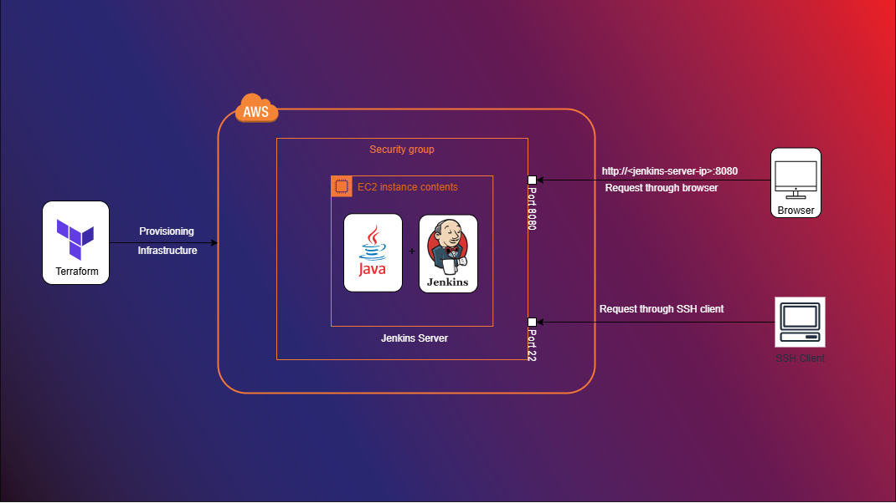

# Jenkins Server Setup with Terraform & Shell Script

This project automates the setup of a **Jenkins** server using **Terraform** for infrastructure provisioning and a custom **Shell Script** (`jenkins_configuration.sh`) to handle the Jenkins installation and configuration.


---

## **Project Overview**

This project was created to streamline **Jenkins setup and automation**, using **Infrastructure as Code (IaC)** principles with **Terraform**. The goal was to create a repeatable process for setting up Jenkins servers that can be used across multiple environments with minimal manual intervention.

---

## **Technologies Used**

- **Terraform**: For provisioning infrastructure.
- **Shell Script**: For automating the installation and configuration of Jenkins.
- **[Cloud Provider]**: (Optional) Specify the cloud platform used (e.g., AWS, GCP, Azure).

---

## **How to Use**

### 1. Clone the repository:
```bash
git clone https://github.com/your-username/jenkins-terraform-setup.git
cd jenkins-terraform-setup
```

### 2. Configure your environment: 
- Ensure **Terraform** is installed on your system.
- Modify the `variables.tf` file to fit your environment (e.g., cloud region, server settings).
- Create a `terraform.tfvars` file to provide the necessary values for the variables. Example:

```bash
region        = "ap-south-1"      # Specify the region
jenkins-key = "jenkins-key"       # Choose the instance type
```

### 3. Run the Terraform commands:
```bash
terraform init
terraform plan
terraform apply
```
This will provision the required infrastructure and automatically execute the `jenkins_configuration.sh` script to install and configure Jenkins.

### 5. Access Jenkins
Once the setup is complete, you can access Jenkins at the following URL:

- **URL**: `http://<your-server-ip-or-domain>:8080`
  - Replace `<your-server-ip-or-domain>` with the actual public IP or domain of your Jenkins server.

You can now log into Jenkins and start configuring your pipelines and jobs.

## **Key Features**

- **Fully automated Jenkins server setup**: The entire setup of Jenkins, including installation and configuration, is automated using a custom shell script (`jenkins_configuration.sh`), reducing manual intervention.
- **Scalable and repeatable infrastructure deployment with Terraform**: Terraform allows you to create and manage your Jenkins infrastructure across different environments in a repeatable, scalable manner.
- **Easy to configure and customize**: The `variables.tf` file and the shell script (`jenkins_configuration.sh`) can be customized for specific use cases, allowing for flexible configurations.
- **Infrastructure as Code (IaC)**: By using Terraform, the infrastructure is provisioned with code, ensuring consistency across deployments and enabling better version control and tracking.

